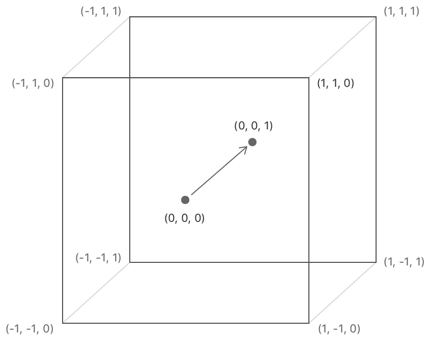
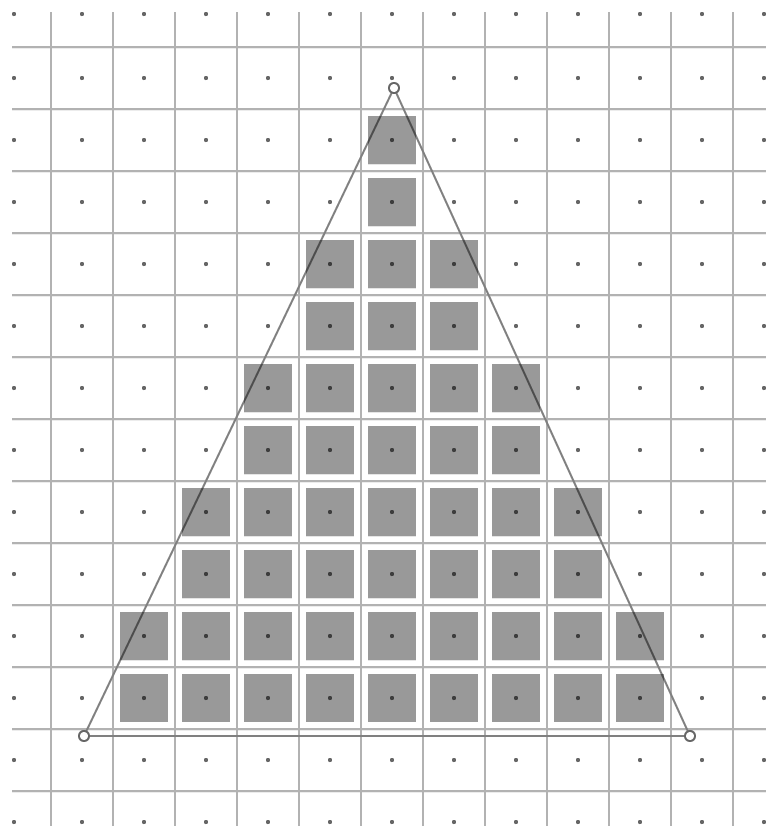
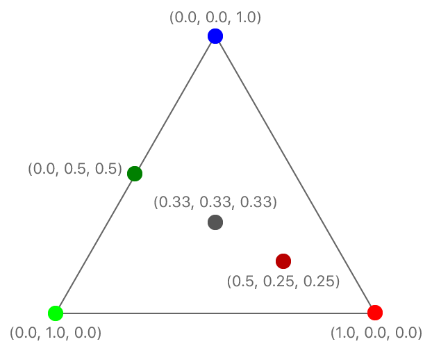

# Using a Render Pipeline to Render Primitives

Render a simple 2D triangle.

## Overview

In Drawing to the Screen Using Metal, you learned how to set up an `MTKView` object and to change the view's contents using a render pass.
That sample simply erased the view's contents to a background color.
This sample shows you how to configure a render pipeline and use it as part of the render pass to draw a simple 2D colored triangle into the view.
The sample supplies a position and color for each vertex, and the render pipeline uses that data to render the triangle, interpolating color values between the colors specified for the triangle's vertices.


- Note: The Xcode project contains schemes for running the sample on macOS, iOS, and tvOS.
Metal isn't supported in the iOS or tvOS Simulator, so the iOS and tvOS schemes require a physical device to run the sample.
The default scheme is macOS.

## Understand the Metal Render Pipeline

A *render pipeline* processes drawing commands and writes data into a render pass’s targets.
 A render pipeline has many stages, some programmed using shaders and others with fixed or configurable behavior.
This sample focuses on the three main stages of the pipeline: the vertex stage, the rasterization stage, and the fragment stage.
The vertex stage and fragment stage are programmable, so you write functions for them in Metal Shading Language (MSL).
The rasterization stage has fixed behavior.

**Figure 1** Main stages of the Metal graphics render pipeline


Rendering starts with a drawing command, which includes a vertex count and what kind of primitive to render. For example, here's the drawing command from this sample:

``` objective-c
// Draw the triangle.
[renderEncoder drawPrimitives:MTLPrimitiveTypeTriangle
                  vertexStart:0
                  vertexCount:3];
```

The vertex stage provides data for each vertex. When enough vertices have been processed, the render pipeline rasterizes the primitive, determining which pixels in the render targets lie within the boundaries of the primitive. The fragment stage determines the values to write into the render targets for those pixels.

In the rest of this sample, you will see how to write the vertex and fragment functions, how to create the render pipeline state object, and finally, how to encode a draw command that uses this pipeline.

## Decide How Data is Processed by Your Custom Render Pipeline

A vertex function generates data for a single vertex and a fragment function generates data for a single fragment, but you decide how they work.
You configure the stages of the pipeline with a goal in mind, meaning that you know what you want the pipeline to generate and how it generates those results.

Decide what data to pass into your render pipeline and what data is passed to later stages of the pipeline. There are typically three places where you do this:

- The inputs to the pipeline, which are provided by your app and passed to the vertex stage.
- The outputs of the vertex stage, which is passed to the rasterization stage.
- The inputs to the fragment stage, which are provided by your app or generated by the rasterization stage.

In this sample, the input data for the pipeline is the position of a vertex and its color. To demonstrate the kind of transformation you typically perform in a vertex function, input coordinates are defined in a custom coordinate space, measured in pixels from the center of the view.

Declare an `AAPLVertex` structure, using SIMD vector types to hold the position and color data.
To share a single definition for how the structure is laid out in memory, declare the structure in a common header and import it in both the Metal shader and the app.

``` objective-c
typedef struct
{
    vector_float2 position;
    vector_float4 color;
} AAPLVertex;
```

SIMD types are commonplace in Metal Shading Language, and you should also use them in your app using the simd library.
SIMD types contain multiple channels of a particular data type, so declaring the position as a `vector_float2` means it contains two 32-bit float values (which will hold the x and y coordinates.)
Colors are stored using a `vector_float4`, so they have four channels – red, green, blue, and alpha.

In the app, the input data is specified using a constant array:

``` objective-c
static const AAPLVertex triangleVertices[] =
{
    // 2D positions,    RGBA colors
    { {  250,  -250 }, { 1, 0, 0, 1 } },
    { { -250,  -250 }, { 0, 1, 0, 1 } },
    { {    0,   250 }, { 0, 0, 1, 1 } },
};
```

The vertex stage generates data for a vertex, so it needs to provide a color and a transformed position.
Declare a `RasterizerData` structure containing a position and a color value, again using SIMD types. 

``` metal
typedef struct
{
    // The [[position]] attribute of this member indicates that this value
    // is the clip space position of the vertex when this structure is
    // returned from the vertex function.
    float4 position [[position]];

    // Since this member does not have a special attribute, the rasterizer
    // interpolates its value with the values of the other triangle vertices
    // and then passes the interpolated value to the fragment shader for each
    // fragment in the triangle.
    float4 color;

} RasterizerData;
```

The output position (described in detail below) must be defined as a `vector_float4`. The color is declared as it was in the input data structure.

You need to tell Metal which field in the rasterization data provides position data, because Metal doesn't enforce any particular naming convention for fields in your struct.
Annotate the `position` field with the `[[position]]` attribute qualifier to declare that this field holds the output position.

The fragment function simply passes the rasterization stage's data to later stages so it doesn't need any additional arguments.

## Declare the Vertex Function

Declare the vertex function, including its input arguments and the data it outputs.
Much like compute functions were declared using the `kernel` keyword, you declare a vertex function using the `vertex` keyword.

``` metal
vertex RasterizerData
vertexShader(uint vertexID [[vertex_id]],
             constant AAPLVertex *vertices [[buffer(AAPLVertexInputIndexVertices)]],
             constant vector_uint2 *viewportSizePointer [[buffer(AAPLVertexInputIndexViewportSize)]])
```

The first argument, `vertexID`, uses the `[[vertex_id]]` attribute qualifier, which is another Metal keyword.
When you execute a render command, the GPU calls your vertex function multiple times, generating a unique value for each vertex.

The second argument, `vertices`, is an array that contains the vertex data, using the `AAPLVertex` struct previously defined.

To transform the position into Metal's coordinates, the function needs the size of the viewport (in pixels) that the triangle is being drawn into, so this is stored in the `viewportSizePointer` argument.

The second and third arguments have the `[[buffer(n)]]` attribute qualifier.
By default, Metal assigns slots in the argument table for each parameter automatically.
When you add the `[[buffer(n)]]` qualifier to a buffer argument, you tell Metal explicitly which slot to use.
Declaring slots explicitly can make it easier to revise your shaders without also needing to change your app code.
Declare the constants for the two indicies in the shared header file.

The function's output is a `RasterizerData` struct.

## Write the Vertex Function

Your vertex function must generate both fields of the output struct. 
Use the `vertexID` argument to index into the `vertices` array and read the input data for the vertex.
Also, retrieve the viewport dimensions.

``` metal
float2 pixelSpacePosition = vertices[vertexID].position.xy;

// Get the viewport size and cast to float.
vector_float2 viewportSize = vector_float2(*viewportSizePointer);

```

Vertex functions must provide position data in *clip-space coordinates*, which are 3D points specified using a four-dimensional homogenous vector (`x,y,z,w`). The rasterization stage takes the output position and divides the `x`,`y`, and `z` coordinates by `w` to generate a 3D point in *normalized device coordinates*. Normalized device coordinates are independent of viewport size.

Normalized device coordinates use a *left-handed coordinate system* and map to positions in the viewport.
Primitives are clipped to a box in this coordinate system and then rasterized.
The lower-left corner of the clipping box is at an `(x,y)` coordinate of `(-1.0,-1.0)` and the upper-right corner is at `(1.0,1.0)`.
Positive-z values point away from the camera (into the screen.)
The visible portion of the `z` coordinate is between `0.0` (the near clipping plane) and `1.0` (the far clipping plane).

**Figure 2** Normalized device coordinate system


Your vertex function needs to transform the input coordinate system to this output coordinate system.

Because this is a 2D application and does not need homogenous coordinates, first write a default value to the output coordinate, with the the `w` value is set to `1.0` and the other coordinates set to `0.0`.
This means that the coordinates are already in the normalized device coordinate space and the vertex function should generate (x,y) coordinates in that coordinate space.
Divide the input position by half the viewport size to generate normalized device coordinates.
Since this calculation is performed using SIMD types, both channels can be divided at the same time using a single line of code.
Perform the divide and put the results in the x and y channels of the output position. 

``` metal
out.position = vector_float4(0.0, 0.0, 0.0, 1.0);
out.position.xy = pixelSpacePosition / (viewportSize / 2.0);
```

Finally, copy the color value into the `out.color` return value.

``` metal
out.color = vertices[vertexID].color;
```

## Write a Fragment Function

A *fragment* is a possible change to the render targets. The rasterizer determines which pixels of the render target are covered by the primitive.
Only fragments whose pixel centers are inside the triangle are rendered.

**Figure 3** Fragments generated by the rasterization stage


A fragment function processes incoming information from the rasterizer for a single position and calculates output values for each of the render targets. These fragment values are processed by later stages in the pipeline, eventually being written to the render targets.

- Note: The reason a fragment is called a possible change is because the pipeline stages after the fragment stage can be configured to reject some fragments or change what gets written to the render targets. In this sample, all values calculated by the fragment stage are written as-is to the render target.

The fragment shader in this sample receives the same parameters that were declared in the vertex shader's output. Declare the fragment function using the `fragment` keyword. It takes a single argument, the same `RasterizerData` structure that was provided by the vertex stage. Add the `[[stage_in]]` attribute qualifier to indicate that this argument is generated by the rasterizer.

``` metal
fragment float4 fragmentShader(RasterizerData in [[stage_in]])
```

If your fragment function writes to multiple render targets, it must declare a struct with fields for each render target.
Because this sample only has a single render target, you specify a floating-point vector directly as the function's output. This output is the color to be written to the render target.

The rasterization stage calculates values for each fragment's arguments and calls the fragment function with them.
The rasterization stage calculates its color argument as a blend of the colors at the triangle's vertices.
The closer a fragment is to a vertex, the more that vertex contributes to the final color.

**Figure 4** Interpolated fragment colors


Return the interpolated color as the function's output. 

``` metal
return in.color;
```

## Create a Render Pipeline State Object

Now that the functions are complete, you can create a render pipeline that uses them.
First, get the default library and obtain a [`MTLFunction`][MTLFunction] object for each function.

``` objective-c
id<MTLLibrary> defaultLibrary = [_device newDefaultLibrary];

id<MTLFunction> vertexFunction = [defaultLibrary newFunctionWithName:@"vertexShader"];
id<MTLFunction> fragmentFunction = [defaultLibrary newFunctionWithName:@"fragmentShader"];
```

Next, create a [`MTLRenderPipelineState`][MTLRenderPipelineState] object.
Render pipelines have more stages to configure, so you use a [`MTLRenderPipelineDescriptor`][MTLRenderPipelineDescriptor] to configure the pipeline.

``` objective-c
MTLRenderPipelineDescriptor *pipelineStateDescriptor = [[MTLRenderPipelineDescriptor alloc] init];
pipelineStateDescriptor.label = @"Simple Pipeline";
pipelineStateDescriptor.vertexFunction = vertexFunction;
pipelineStateDescriptor.fragmentFunction = fragmentFunction;
pipelineStateDescriptor.colorAttachments[0].pixelFormat = mtkView.colorPixelFormat;

_pipelineState = [_device newRenderPipelineStateWithDescriptor:pipelineStateDescriptor
                                                         error:&error];
```

In addition to specifying the vertex and fragment functions, you also declare the *pixel format* of all render targets that the pipeline will draw into.
A pixel format ([`MTLPixelFormat`][MTLPixelFormat]) defines the memory layout of pixel data.
For simple formats, this definition includes the number of bytes per pixel, the number of channels of data stored in a pixel, and the bit layout of those channels.
Since this sample only has one render target and it is provided by the view, copy the view's pixel format into the render pipeline descriptor.
Your render pipeline state must use a pixel format that is compatible with the one specified by the render pass.
In this sample, the render pass and the pipeline state object both use the view's pixel format, so they are always the same.

When Metal creates the render pipeline state object, the pipeline is configured to convert the fragment function's output into the render target's pixel format.
If you want to target a different pixel format, you need to create a different pipeline state object.
You can reuse the same shaders in multiple pipelines targeting different pixel formats.

 
## Set a Viewport

Now that you have the render pipeline state object for the pipeline, you'll render the triangle. You do this using a render command encoder. First, set the viewport, so that Metal knows which part of the render target you want to draw into.

``` objective-c
// Set the region of the drawable to draw into.
[renderEncoder setViewport:(MTLViewport){0.0, 0.0, _viewportSize.x, _viewportSize.y, 0.0, 1.0 }];
```

## Set the Render Pipeline State

Set the render pipeline state for the pipeline you want to use.

``` objective-c
[renderEncoder setRenderPipelineState:_pipelineState];
```

## Send Argument Data to the Vertex Function

Often, you use buffers ([`MTLBuffer`][MTLBuffer]) to pass data to shaders.
However, when you need to pass only a small amount of data to the vertex function, as is the case here, copy the data directly into the command buffer.

The sample copies data for both parameters into the command buffer.
The vertex data is copied from an array defined in the sample.
The viewport data is copied from the same variable that you used to set the viewport. 

In this sample, the fragment function uses only the data it receives from the rasterizer, so there are no arguments to set.

``` objective-c
[renderEncoder setVertexBytes:triangleVertices
                       length:sizeof(triangleVertices)
                      atIndex:AAPLVertexInputIndexVertices];

[renderEncoder setVertexBytes:&_viewportSize
                       length:sizeof(_viewportSize)
                      atIndex:AAPLVertexInputIndexViewportSize];
```


## Encode the Drawing Command

Specify the kind of primitive, the starting index, and the number of vertices.
When the triangle is rendered, the vertex function is called with values of 0, 1, and 2 for the `vertexID` argument.

``` objective-c
// Draw the triangle.
[renderEncoder drawPrimitives:MTLPrimitiveTypeTriangle
                  vertexStart:0
                  vertexCount:3];
```

As with Drawing to the Screen Using Metal, you end the encoding process and commit the command buffer.
However, you could encode more render commands using the same set of steps.
The final image is rendered as if the commands were processed in the order they were specified.
(For performance, the GPU is allowed to process commands or even parts of commands in parallel, so long as the final result appears to have been rendered in order. )

## Experiment with the Color Interpolation

In this sample, color values were interpolated across the triangle.
That's often what you want, but sometimes you want a value to be generated by one vertex and remain constant across the whole primitive.
Specify the `flat` attribute qualifier on an output of the vertex function to do this.
Try this now.
Find the definition of `RasterizerData` in the sample project and add the `[[flat]]` qualifier to its `color` field.

`float4 color [[flat]];`

Run the sample again.
The render pipeline uses the color value from the first vertex (called the *provoking vertex*) uniformly across the triangle, and it ignores the colors from the other two vertices.
You can use a mix of flat shaded and interpolated values, simply by adding or omitting the `flat` qualifier on your vertex function's outputs.
The [Metal Shading Language specification][ShadingLanguageSpec] defines other attribute qualifiers you can also use to modify the rasterization behavior.

[ScreenDrawing]: https://developer.apple.com/documentation/metal
[MTLDevice]: https://developer.apple.com/documentation/metal/mtldevice
[MTLResource]: https://developer.apple.com/documentation/metal/mtlresource
[MTLBuffer]: https://developer.apple.com/documentation/metal/mtlbuffer
[MTLRenderPipelineState]: https://developer.apple.com/documentation/metal/mtlrenderpipelinestate
[MTLRenderPipelineDescriptor]: https://developer.apple.com/documentation/metal/mtlrenderpipelinedescriptor
[MTLRenderCommandEncoder]: https://developer.apple.com/documentation/metal/mtlrendercommandencoder
[MTLPixelFormat]: https://developer.apple.com/documentation/metal/mtlpixelformat
[MTKView]: https://developer.apple.com/documentation/metalkit/mtkview
[ShadingLanguageSpec]: https://developer.apple.com/metal/Metal-Shading-Language-Specification.pdf
[MTLFunction]: https://developer.apple.com/documentation/metal/mtlfunction